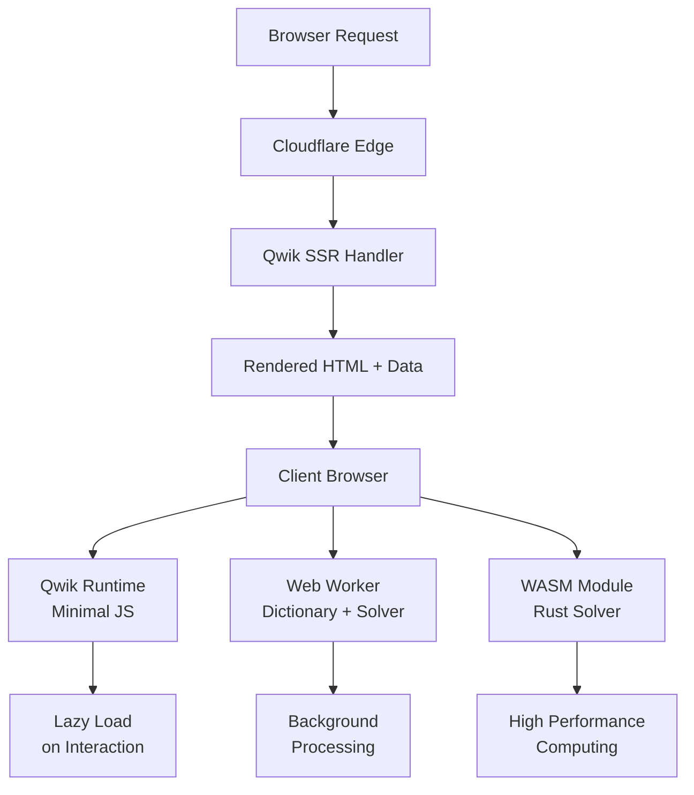
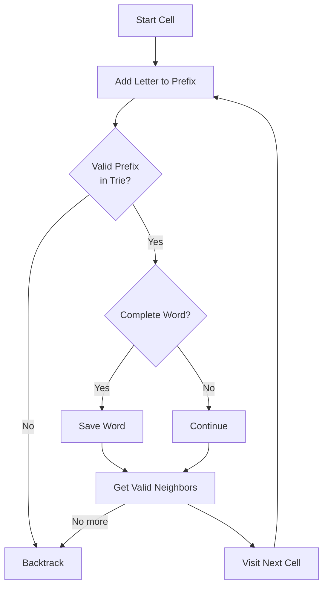
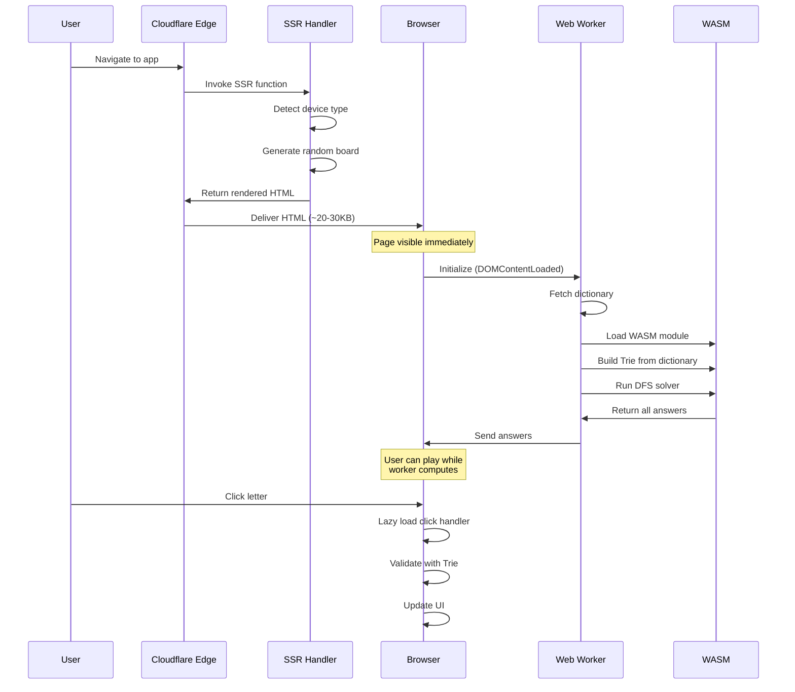
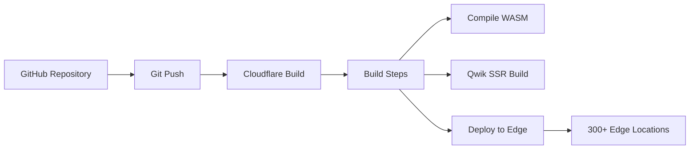

# Boggle Game - Architecture Overview

## Product Description

### What It Is
A web-based Boggle word puzzle game where players find words by connecting adjacent letters on a grid.

### What It Does
- Generates randomized 5×5 Boggle boards
- Validates words in real-time as players select letters
- Computes all possible valid words for any board
- Tracks player progress through a leveling system
- Adapts UI based on device type (mobile vs desktop)
- Provides audio and visual feedback for successful word discoveries

### How It Works
The application uses a three-tier performance architecture:

1. **Server-Side Rendering (SSR)** - HTML rendered on server with embedded board configuration for instant visual feedback
2. **WebAssembly Computation** - Rust-based solver compiled to WASM for computationally intensive word-finding
3. **Web Worker Offloading** - Dictionary loading and answer computation in background thread for responsive UI
4. **Lazy Hydration** - Interactive components loaded on-demand to minimize initial JavaScript payload

---

## System Architecture

See [architecture-detailed.mmd](./diagrams/architecture-detailed.mmd) for full system diagram.

---

## Performance Strategy

### Server-Side Rendering Benefits
- **Instant First Paint** - Users see game board immediately without waiting for JavaScript
- **SEO Optimization** - Search engines can crawl fully-rendered HTML
- **Device-Aware Rendering** - Server detects device type and adjusts board dimensions
- **Progressive Enhancement** - Game functional even if JavaScript fails

### Client-Side Lazy Computation
- **Web Worker Initialization** - Dictionary loading and solving happen in background thread
- **Non-Blocking Main Thread** - UI remains responsive during expensive computations
- **Progressive Loading** - Dictionary fetched and cached only once
- **Deferred Answers** - All valid words computed in background while user plays

### Qwik Framework Advantages

#### Resumability (Zero Hydration)
Traditional frameworks require hydration: HTML arrives → Download JS → Parse JS → Execute entire app → Rebuild state → Attach listeners → Interactive

Qwik's approach: HTML arrives → Interactive immediately → Load JS only when user interacts

This is achieved through:
- **Serializable State** - All component state serialized in HTML
- **Fine-grained Lazy Loading** - Each event handler is separate, lazy-loadable chunk
- **Automatic Code Splitting** - Qwik splits code at component and function boundaries

#### Key Performance Features
- **Minimal Initial JavaScript** - Only ~5KB loaded initially
- **Event-Driven Code Loading** - JavaScript for event handlers loads on-demand
- **Smart Prefetching** - Qwik prefetches code for visible interactive elements
- **Edge Rendering** - SSR happens on Cloudflare's edge network, close to users

---

## Core Algorithms & Data Structures

### Trie Data Structure

#### Why Tries?

**Time Complexity:**
- Word Lookup: O(m) where m = word length
- Prefix Check: O(m) where m = prefix length

**Comparison to Alternatives:**
- **Hash Set**: O(1) word lookup but cannot efficiently check prefix existence
- **Sorted Array + Binary Search**: O(log n) lookup but slower prefix checks
- **Trie**: Optimal for both complete word validation AND prefix validation (essential for early pruning during board solving)

#### Implementation Locations
- **TypeScript Trie**: `src/components/boggle/logic/trie.ts` - Used for client-side word validation
- **Rust Trie**: `src/components/boggle/boggle-solver/src/trie.rs` - Used in WASM solver for performance

### Depth-First Search Word Finding

The core word-finding logic uses backtracking DFS with Trie pruning.

#### Algorithm Characteristics
- **Early Termination**: Invalid prefixes stop exploration immediately using Trie
- **Backtracking**: Visited cells are marked/unmarked as recursion unwinds
- **8-Direction Movement**: Explores all adjacent cells including diagonals
- **Duplicate Prevention**: Each word added only once to results

#### Complexity Analysis
- **Worst Case**: O(8^L × N) where L = max word length, N = board cells
- **With Trie Pruning**: Dramatically reduced in practice
- **Typical Real-World**: O(N × W) where W = average words per cell (~10-50)

### Board Generation
Boards generated with weighted character frequencies matching real English language distribution (more E, T, A, O than Z, Q, X).

---

## Technology Stack

### Frontend
- **Framework**: Qwik v0.18.1 (SSR-first React-like framework) → **Needs upgrade to v1.18.0**
- **Router**: QwikCity v0.2.1 (file-based routing) → **Needs upgrade to v1.18.0**
- **Styling**: TailwindCSS v3.1.8 (utility-first CSS)
- **Language**: TypeScript 4.9.4 → **Upgrade to v5.x recommended**
- **Build Tool**: Vite 4.0.3 → **Upgrade to v6.x available**

### Backend/Build Tools
- **Language**: Rust (for WASM solver)
- **WASM**: wasm-pack v0.10.3, wasm-bindgen
- **Deployment**: Cloudflare Pages & Workers
- **CLI**: Wrangler (Cloudflare CLI)

### Performance Tools
- **Web Workers**: Native browser API for background processing
- **WebAssembly**: High-performance compiled Rust code
- **Vite Plugins**: WASM module support, top-level await, path alias resolution

---

## Application Lifecycle

### Phase Breakdown

#### 1. Request Phase
User navigates to URL → Request hits nearest Cloudflare Edge → SSR Worker Function invoked

#### 2. Server Work Phase
- Parse User-Agent to detect device (iOS, Android, Mac, Windows, ChromeOS)
- Determine board width (350px mobile, 400px desktop)
- Generate random 5×5 board with weighted character distribution
- Render complete HTML with serialized state

#### 3. Response Phase
- Server sends fully rendered HTML (~20-30KB compressed)
- Total initial payload includes CSS (~10KB) and Qwik loader (~5KB)
- Time to First Paint: <100ms
- Time to Interactive: <200ms (board clickable immediately)

#### 4. Client Work Phase
**Phase 4A: Immediate Hydration (Qwik Resumability)**
- Traditional frameworks: Parse HTML → Download JS → Execute app → Rebuild state → Attach listeners
- Qwik: Parse HTML → Interactive (listeners attached via HTML attributes)

**Phase 4B: Background Worker Initialization**
Timeline:
- 0ms: Main thread ready, user can interact
- 100ms: Worker starts
- 200ms: Fetch dictionary (~200KB)
- 400ms: Parse dictionary (200,000+ words)
- 500ms: Load WASM module (~100KB)
- 600ms: Build Trie in WASM memory
- 800ms: Run DFS solver
- 1000ms: Send all answers to main thread

Critical: UI never blocks during this process

#### 5. Interactivity Phase
- User clicks letter → Qwik fetches click handler code (~2KB) on first click only
- Letter added to selection path
- Trie validates if path forms valid word (O(m) lookup)
- If valid word found: Play audio, trigger confetti, update score
- Reactive updates via Qwik's automatic dependency tracking

---

## Deployment & CI/CD

### Build Process
1. npm install dependencies
2. Compile Rust to WASM (wasm-pack build)
3. Run Qwik SSR build (vite build)
4. Generate routing configuration
5. Deploy to Cloudflare's global edge network

### Deployment Strategy
- **Production**: main branch → Auto-deploy to production URL
- **Preview**: Feature branches → Unique preview URLs
- **Caching**: Static assets (JS/CSS/WASM) cached 1 year, HTML no-cache

### CI/CD Integration
GitHub repository connected to Cloudflare Pages enables:
- Automatic builds on push
- Preview environments for pull requests
- Rollback capabilities
- Build logs and error tracking

---

## File Structure

### Entry Points
- `src/routes/index.tsx` - Main page entry, server loader
- `src/root.tsx` - App root, HTML structure
- `src/entry.ssr.tsx` - SSR entry point
- `src/entry.cloudflare-pages.tsx` - Cloudflare Pages adapter

### Core Components
- `src/components/boggle/BoggleRoot.tsx` - Main game component, context providers
- `src/components/boggle/board/` - Board grid and letter cell components
- `src/components/boggle/controls/` - Game controls and word display UI
- `src/components/boggle/user/` - Level and stats tracking

### Business Logic
- `src/components/boggle/logic/server.ts` - SSR: board generation, device detection
- `src/components/boggle/logic/board.ts` - Board utilities, word validation
- `src/components/boggle/logic/trie.ts` - TypeScript Trie implementation
- `src/components/boggle/logic/boggle.ts` - Game logic
- `src/components/boggle/worker.ts` - Web Worker implementation

### WASM Solver (Rust)
- `src/components/boggle/boggle-solver/src/lib.rs` - WASM entry, JS bindings
- `src/components/boggle/boggle-solver/src/trie.rs` - Rust Trie
- `src/components/boggle/boggle-solver/src/solver.rs` - DFS algorithm
- `src/components/boggle/boggle-solver/Cargo.toml` - Rust dependencies

### Configuration
- `package.json` - npm dependencies, build scripts
- `tsconfig.json` - TypeScript configuration
- `tailwind.config.js` - Tailwind CSS configuration
- `vite.config.ts` - Vite build configuration

---

## Context System

The application uses Qwik's context system for state management:

- **DictionaryCtx** - Dictionary words array (200K+ words)
- **BoardCtx** - Board state (characters, size, dimensions)
- **GameCtx** - Game state (level, selected characters, min word length)
- **AnswersCtx** - All possible answers and user's found words
- **WorkerCtx** - Web Worker reference (non-serializable)

Context providers established in BoggleRoot component, consumed by child components throughout tree.

---

## Key Development Commands

- **`npm run wasm`** - Compile Rust to WASM (required after Rust changes)
- **`npm run dev`** - Start development server (auto-compiles WASM first)
- **`npm run build`** - Full production build
- **`npm run deploy`** - Test with local Cloudflare Pages simulation

---

## Critical Design Decisions

### Why Qwik?
- **Zero Hydration** - Instant interactivity without re-executing app code
- **Fine-Grained Lazy Loading** - Only load code that's actually needed
- **SSR-First** - Built for server-side rendering from ground up
- **Automatic Optimization** - Framework handles code splitting and prefetching

### Why WebAssembly for Solver?
- **Performance** - Rust compiles to highly optimized machine code
- **Type Safety** - Rust's strong type system prevents bugs
- **Portable** - WASM runs consistently across all browsers
- **Non-Blocking** - Computation happens in Web Worker off main thread

### Why Trie Data Structure?
- **Prefix Validation** - Essential for early pruning in DFS algorithm
- **Fast Lookups** - O(m) for both word and prefix checks
- **Memory Efficient** - Shared prefixes stored only once
- **Perfect Fit** - Ideal for dictionary-based word games

### Why Cloudflare Pages?
- **Global Edge Network** - 300+ locations for low latency
- **Integrated Workers** - SSR happens at the edge, not origin server
- **Git Integration** - Automatic deployments on push
- **Free Tier** - Generous limits for personal projects

---

See individual diagram files in `overview/diagrams/` for detailed architecture visualizations.

