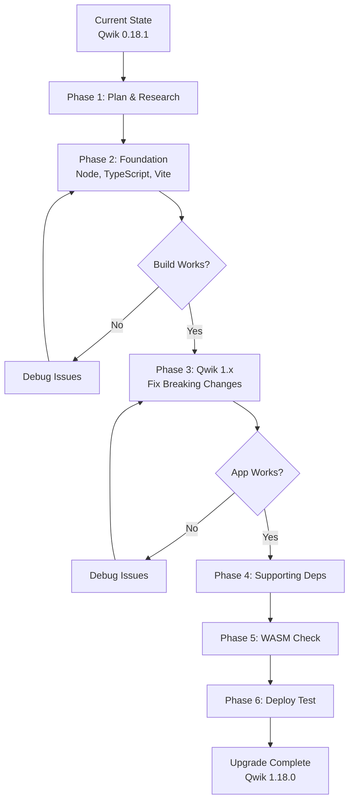

# Qwik Framework Upgrade Guide

## Current Status

### Installed Versions

| Package               | Current      | Latest       | Gap                         | Status      |
| --------------------- | ------------ | ------------ | --------------------------- | ----------- |
| @builder.io/qwik      | **0.18.1**   | **1.18.0**   | 1 major version             | 🔴 Critical |
| @builder.io/qwik-city | **0.2.1**    | **1.18.0**   | 1 major version + alignment | 🔴 Critical |
| vite                  | **4.0.3**    | **6.0.x**    | 2 major versions            | 🔴 Critical |
| typescript            | **4.9.4**    | **5.7.x**    | 1 major version             | 🟡 High     |
| node requirement      | **>=15.0.0** | **>=18.0.0** | Outdated                    | 🟡 High     |

**Project Age**: ~2 years behind (as of December 2024)

**Risk Level**: 🔴 **HIGH** - Major breaking changes expected in Qwik v1.x

---

## Upgrade Impact

### Qwik: 0.18.1 → 1.18.0

**Breaking Changes Expected:**

- Loader API changed (loader$ → routeLoader$)
- Context API changed (createContext → createContextId)
- Event handling patterns may have evolved
- Build output structure may differ
- Routing conventions in QwikCity significantly updated

**Benefits:**

- Improved performance (smaller bundles, faster hydration)
- Better developer experience
- Stability improvements and bug fixes
- New features (improved streaming SSR)
- Enhanced TypeScript support
- Better prefetching strategies

**Effort Estimate**: 8-16 hours (including testing)

### QwikCity: 0.2.1 → 1.18.0

**Breaking Changes Expected:**

- File-based routing conventions may have changed
- Layout system may have evolved
- Data loading patterns updated (loader$ function signatures)
- Server functions API matured

**Benefits:**

- Alignment with Qwik 1.x ecosystem
- Improved routing performance
- Better server-side data fetching
- Enhanced middleware support

**Effort Estimate**: 4-8 hours (covered mostly by Qwik upgrade)

### Supporting Dependencies

**Vite: 4.0.3 → 6.0.x**

- Plugin API updates (affects WASM plugin)
- Build output changes
- Dev server configuration updates
- Some config options renamed/removed

**TypeScript: 4.9.4 → 5.7.x**

- Stricter type checking (may reveal hidden bugs)
- Some deprecated features removed
- New language features available

**Node.js: >=15.0.0 → >=18.0.0**

- Better performance and security
- Required for latest tooling

---

## Upgrade Strategy

### Phase 1: Research & Planning (2-4 hours)

**Actions:**

1. Review Qwik migration guides at qwik.dev/docs/migrations/
2. Read Qwik v1.0 release notes and changelogs
3. Check current app for deprecation warnings (run dev server, check console)
4. Read Vite 5.0 and 6.0 migration guides
5. Create backup branch and tag current version
6. Set aside 3-5 days for upgrade work

**Expected Findings:**

- API renames in core Qwik functions
- Router loader signature changes
- Context API modifications
- Build configuration updates

### Phase 2: Foundation (2-3 hours)

**Sequence:**

1. Update Node.js to v18 or v20 (if needed)
2. Update TypeScript to v5.x
3. Update Vite to v5.x first, test, then v6.x
4. Update Vite plugins (WASM, top-level-await, tsconfig-paths)

**Checkpoint**: Ensure build still works with updated tooling before proceeding to Qwik

### Phase 3: Qwik Framework (8-12 hours)

**Major Work Phase:**

1. Update Qwik and QwikCity to v1.18.0
2. Fix loader function signatures (routeLoader$ pattern)
3. Update context API usage (createContextId pattern)
4. Fix any component import changes
5. Update routing patterns if needed
6. Test all game functionality

**Expected Breaking Changes:**

- Loader functions need async/await patterns
- Context creation uses different API
- Some lifecycle hooks may have changed
- Event handler patterns may have evolved

**Checkpoint**: Application works locally with all features functional

### Phase 4: Supporting Dependencies (2-3 hours)

**Update:**

- Dev dependencies (ESLint, Prettier, TailwindCSS)
- Production dependencies (canvas-confetti, tone, ua-parser-js)

**Test:** Verify audio, confetti, and user-agent detection still work

### Phase 5: WASM Compatibility (1-2 hours)

**Actions:**

1. Recompile WASM with updated environment
2. Verify WASM loads in browser
3. Test word-finding solver functionality
4. Check Web Worker communication

**Checkpoint**: Dictionary loads, answers compute correctly

### Phase 6: Cloudflare Deployment (2-3 hours)

**Actions:**

1. Update Wrangler CLI
2. Test local Cloudflare Pages simulation
3. Update Node version in Cloudflare dashboard (set to 18)
4. Deploy to preview environment
5. Test production build

**Checkpoint**: Production deployment successful

---

## Testing Strategy

### Automated Tests

- Type checking (npm run build.types)
- Linting (npm run lint)
- Build test (npm run build)
- Production preview (npm run preview)

### Manual Testing Priority

**Critical Path** (must work):

1. Page loads at localhost:5173
2. Board renders with 25 letters
3. Letters clickable and highlight
4. Valid words recognized
5. Found words list updates
6. Audio plays on word found
7. Level progression works

**Performance Checks**:

- Initial page load < 1 second
- Time to Interactive < 2 seconds
- JavaScript bundle < 50KB initial
- WASM module loads without errors
- Web Worker initializes successfully

**Device Testing**:

- Desktop view (400px board)
- Mobile view (350px board)
- Touch interactions work

**SSR Verification**:

- View page source shows rendered board (not empty divs)
- JavaScript disabled shows static board
- No hydration mismatch errors

### Browser Compatibility

Test in: Chrome, Firefox, Safari, Edge, Mobile Safari, Mobile Chrome

---

## Rollback Plan

### If Upgrade Fails

**Option 1: Git Reset**

- Reset to pre-upgrade tag
- Discard all changes
- Reinstall old dependencies

**Option 2: Revert Specific Files**

- Revert package.json and package-lock.json
- Reinstall dependencies
- Keep compatible changes

**Option 3: Emergency Production Fix**

- Revert last deployment in Cloudflare dashboard
- Redeploy previous commit
- Investigate issue in staging environment

### Checkpoint Tags

Create tags at each phase:

- checkpoint-01-typescript-updated
- checkpoint-02-vite-updated
- checkpoint-03-qwik-updated
- checkpoint-04-dependencies-updated
- checkpoint-05-deployment-tested

---

## Known API Changes (0.18.1 → 1.18.0)

### Loader Functions

- **Old Pattern**: loader$ with synchronous return
- **New Pattern**: routeLoader$ with async return
- **Impact**: All server data loading functions need updating

### Context API

- **Old Pattern**: createContext for creating contexts
- **New Pattern**: createContextId for type-safe context creation
- **Impact**: All context definitions need updating

### Component Lifecycle

- **Old Pattern**: May use useOnWindow for certain lifecycle events
- **New Pattern**: Potentially useOnDocument or updated hook names
- **Impact**: Event initialization code needs review

### Build Output

- **Old Pattern**: Specific directory structure and naming
- **New Pattern**: Updated structure in v1.x
- **Impact**: May affect deployment configuration

---

## Post-Upgrade Optimization

Once upgrade is stable, leverage new v1.x features:

### Performance Enhancements

- Enable improved prefetching strategies
- Configure enhanced streaming SSR
- Utilize better code splitting options
- Enable Qwik DevTools browser extension

### Performance Audit

Run Lighthouse audit targeting:

- Performance score: > 90
- First Contentful Paint: < 1s
- Time to Interactive: < 2s
- Total Blocking Time: < 200ms
- Cumulative Layout Shift: < 0.1

---

## Continuous Maintenance

### Update Schedule

**Monthly:**

- Check for Qwik patch releases
- Update dev dependencies

**Quarterly:**

- Update all dependencies
- Run full test suite
- Performance audit

**Annually:**

- Major version upgrades (if Qwik v2.x arrives)
- Security audit
- Dependency cleanup

### Stay Informed

- Subscribe to Qwik Blog (qwik.dev/blog/)
- Watch Qwik GitHub Releases
- Join Qwik Discord community
- Follow @QwikDev on Twitter

### Automated Updates

Consider Dependabot or Renovate for automated dependency update PRs

---

## Timeline & Effort

**Total Estimated Time**: 15-23 hours

| Phase                   | Time Estimate |
| ----------------------- | ------------- |
| Research & Planning     | 2-4 hours     |
| Foundation Updates      | 2-3 hours     |
| Qwik Framework          | 8-12 hours    |
| Supporting Dependencies | 2-3 hours     |
| WASM Compatibility      | 1-2 hours     |
| Cloudflare Deployment   | 2-3 hours     |

**Realistic Schedule**: 3-5 working days for one developer

---

## Success Criteria

Upgrade considered successful when:

✅ **Functionality**

- All game features work (board, words, audio, levels)
- WASM solver computes answers correctly
- Web Worker loads dictionary successfully

✅ **Performance**

- Lighthouse score ≥ 90
- Time to Interactive ≤ 2s
- Initial JS bundle ≤ 50KB

✅ **Quality**

- No TypeScript errors
- No console errors during normal usage
- All linting passes

✅ **Deployment**

- Builds successfully on Cloudflare Pages
- Production site works correctly
- No 404 errors for assets

✅ **Documentation**

- All docs updated to reflect v1.x patterns
- Upgrade experience documented

---

## Risk Mitigation

**Strategies:**

- Branch-based development (no direct main changes)
- Incremental upgrades (one major dependency at a time)
- Comprehensive testing at each phase
- Multiple checkpoint tags for rollback
- Preview environment testing before production

**Contingency:**

- Rollback plan ready and tested
- Previous version tagged
- Production deployment can be reverted
- Staging environment available for testing

---

## Resources

### Official Documentation

- Qwik Docs: https://qwik.dev/docs/
- Qwik Migration Guide: https://qwik.dev/docs/migrations/
- Qwik GitHub: https://github.com/BuilderIO/qwik
- Vite Migration: https://vitejs.dev/guide/migration

### Community

- Qwik Discord: https://qwik.dev/chat/
- Qwik Examples: https://github.com/BuilderIO/qwik/tree/main/starters

---

**Remember**: This is a major upgrade spanning 2 years of framework evolution. Take time, test thoroughly, and don't skip phases!

Good luck! 🚀
